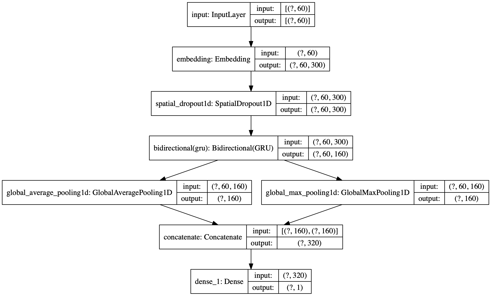

## R interface to Keras Tuner

The kerastuneR package provides R wrappers to [Keras Tuner](https://keras-team.github.io/keras-tuner/).

Keras Tuner is a hypertuning framework made for humans. 
It aims at making the life of AI practitioners, hypertuner algorithm creators and model designers as simple as possible by providing them with a clean and easy to use API for hypertuning. Keras Tuner makes moving from a base model to a hypertuned one quick and easy by only requiring you to change a few lines of code.


[](https://github.com/henry090/kerastuneR)
[](https://travis-ci.com/henry090/kerastuneR)
[](https://cran.r-project.org/package=kerastuneR)
<br>
[](https://www.tidyverse.org/lifecycle/#experimental)
[](https://codecov.io/gh/henry090/kerastuneR?branch=master)
[](https://cran.r-project.org/package=kerastuneR)
<br>
[](https://github.com/henry090/kerastuneR/commits/master)
[](https://github.com/henry090/kerastuneR)


A hyperparameter tuner for [Keras](https://keras.io/), specifically for ```tf$keras``` with *TensorFlow 2.0*.

Full documentation and tutorials available on the [Keras Tuner website](https://henry090.github.io/kerastuneR/).

## Installation

Requirements:

- Python 3.6
- TensorFlow 2.0

```kerastuneR``` can be installed from CRAN:

```
install.packages('kerastuneR')
```

The dev version:

```
devtools::install_github('henry090/kerastuneR')
```

Later, you need to install the python module kerastuner:

```
kerastuneR::install_kerastuner()
```

## Usage: the basics

Here's how to perform hyperparameter tuning for a single-layer dense neural network using random search.

First, we define a model-building function. It takes an argument ```hp``` from which you can sample hyperparameters, such as ```hp$Int('units', min_value = 32, max_value = 512, step = 32)``` (an integer from a certain range).

Sample data:

```
library(magrittr)
x_data <- matrix(data = runif(500,0,1),nrow = 50,ncol = 5)
y_data <-  ifelse(runif(50,0,1) > 0.6, 1L,0L) %>% as.matrix()

x_data2 <- matrix(data = runif(500,0,1),nrow = 50,ncol = 5)
y_data2 <-  ifelse(runif(50,0,1) > 0.6, 1L,0L) %>% as.matrix()
```

This function returns a compiled model.

```
library(keras)
library(tensorflow)
library(kerastuneR)

build_model = function(hp) {
  
  model = keras_model_sequential()
  model %>% layer_dense(units = hp$Int('units',
                                     min_value = 32,
                                     max_value = 512,
                                     step=  32),input_shape = ncol(x_data),
                        activation =  'relu') %>%
    layer_dense(units = 1, activation = 'softmax') %>%
    compile(
      optimizer = tf$keras$optimizers$Adam(
        hp$Choice('learning_rate',
                  values=c(1e-2, 1e-3, 1e-4))),
      loss = 'binary_crossentropy',
      metrics = 'accuracy')
  return(model)
}
```

Next, instantiate a tuner. You should specify the model-building function, the name of the objective to optimize (whether to minimize or maximize is automatically inferred for built-in metrics), the total number of trials ```(max_trials)``` to test, and the number of models that should be built and fit for each trial ```(executions_per_trial)```.

Available tuners are ```RandomSearch``` and ```Hyperband```.

> Note: the purpose of having multiple executions per trial is to reduce results variance and therefore be able to more accurately assess the performance of a model. If you want to get results faster, you could set executions_per_trial=1 (single round of training for each model configuration).

```
tuner = RandomSearch(
    build_model,
    objective = 'val_accuracy',
    max_trials = 5,
    executions_per_trial = 3,
    directory = 'my_dir',
    project_name = 'helloworld')
```

You can print a summary of the search space:

```
tuner %>% search_summary()
```

Then, start the search for the best hyperparameter configuration. The call to search has the same signature as ```model %>% fit()```. But here instead of ```fit()``` we call ```fit_tuner()```.

```
tuner %>% fit_tuner(x_data,y_data,
                    epochs = 5, 
                    validation_data = list(x_data2,y_data2))
```

### Plot results

There is a function ```plot_tuner``` which allows user to plot the search results. For this purpose, we used the parallel coordinates plot from ```plotly```. This function allows to get a data.frame of the results, as well.

```
result = kerastuneR::plot_tuner(tuner)
# the list will show the plot and the data.frame of tuning results
result 
```


### Plot Keras model

First one should extract the list of tuned models and then using function ```plot_keras_model``` to plot the model architecture.

```
best_5_models = tuner %>% get_best_models(5)
best_5_models[[1]] %>% plot_keras_model()
```

<center></center>

## You can easily restrict the search space to just a few parameters

If you have an existing hypermodel, and you want to search over only a few parameters (such as the learning rate), you can do so by passing a ```hyperparameters``` argument to the tuner constructor, as well as ```tune_new_entries=FALSE``` to specify that parameters that you didn't list in ```hyperparameters``` should not be tuned. For these parameters, the default value gets used.

```
library(keras)
library(kerastuneR)
library(magrittr)

mnist_data = dataset_fashion_mnist()
c(mnist_train, mnist_test) %<-%  mnist_data
rm(mnist_data)

mnist_train$x = tf$dtypes$cast(mnist_train$x, 'float32') / 255.
mnist_test$x = tf$dtypes$cast(mnist_test$x, 'float32') / 255.

mnist_train$x = keras::k_reshape(mnist_train$x,shape = c(6e4,28,28))
mnist_test$x = keras::k_reshape(mnist_test$x,shape = c(1e4,28,28))


hp = HyperParameters()
hp$Choice('learning_rate', c(1e-1, 1e-3))
hp$Int('num_layers', 2L, 20L)


mnist_model = function(hp) {
  
  model = keras_model_sequential() %>% 
    layer_flatten(input_shape = c(28,28))
  for (i in 1:(hp$get('num_layers')) ) {
    model %>% layer_dense(32, activation='relu') %>% 
      layer_dense(units = 10, activation='softmax')
  } %>% 
    compile(
      optimizer = tf$keras$optimizers$Adam(hp$get('learning_rate')),
      loss = 'sparse_categorical_crossentropy',
      metrics = 'accuracy') 
  return(model)
  
}


tuner = RandomSearch(
  hypermodel =  mnist_model,
  max_trials = 5,
  hyperparameters = hp,
  tune_new_entries = T,
  objective = 'val_accuracy',
  directory = 'dir_1',
  project_name = 'mnist_space')

tuner %>% fit_tuner(x = mnist_train$x,
                    y = mnist_train$y,
                    epochs = 5,
                    validation_data = list(mnist_test$x, mnist_test$y))


```

## You can use a HyperModel subclass instead of a model-building function

This makes it easy to share and reuse hypermodels.

A ```HyperModel``` subclass only needs to implement a ```build(self, hp)``` method.

```
library(keras)
library(tensorflow)
library(magrittr)
library(kerastuneR)

x_data <- matrix(data = runif(500,0,1),nrow = 50,ncol = 5)
y_data <- ifelse(runif(50,0,1) > 0.6, 1L,0L) %>% as.matrix()

x_data2 <- matrix(data = runif(500,0,1),nrow = 50,ncol = 5)
y_data2 <- ifelse(runif(50,0,1) > 0.6, 1L,0L) %>% as.matrix()


HyperModel <- reticulate::PyClass(
  'HyperModel',
  inherit = kerastuneR::HyperModel_class(),
  list(
    
    `__init__` = function(self, num_classes) {
      
      self$num_classes = num_classes
      NULL
    },
    build = function(self,hp) {
      model = keras_model_sequential() 
      model %>% layer_dense(units = hp$Int('units',
                                           min_value = 32,
                                           max_value = 512,
                                           step = 32),
                            input_shape = ncol(x_data),
                            activation = 'relu') %>% 
        layer_dense(as.integer(self$num_classes), activation = 'softmax') %>% 
        compile(
          optimizer = tf$keras$optimizers$Adam(
            hp$Choice('learning_rate',
                      values = c(1e-2, 1e-3, 1e-4))),
          loss = 'sparse_categorical_crossentropy',
          metrics = 'accuracy')
    }
  )
)

hypermodel = HyperModel(num_classes = 10)


tuner = RandomSearch(hypermodel = hypermodel,
                      objective = 'val_accuracy',
                      max_trials = 2,
                      executions_per_trial = 1,
                      directory = 'my_dir5',
                      project_name = 'helloworld')

```

Documentation, advanced model tuning, and tutorials can be found on https://henry090.github.io/kerastuneR/


